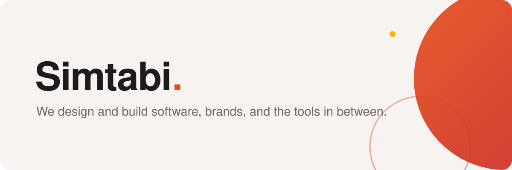

  <a href="https://simtabi.com">
    <picture>
      <source media="(prefers-color-scheme: dark)" srcset="banner-dark.svg">
      
    </picture>
  </a>

# We design and build software, brands, and the tools in between.

[Simtabi](https://simtabi.com) is a software design agency and design & branding
studio operating across New York, Delaware, and North Carolina, USA. We take on
the whole picture: product engineering, web and mobile apps, brand identity,
graphic design, and the visual systems that hold them together. When a tool we
build earns its keep beyond our own desks, we open-source it and keep
maintaining it.

## Tools born from real problems

Every project here started as an itch we had to scratch:

- [probaci](https://github.com/simtabi/probaci) — because "fix CI" commits
  shouldn't exist. It runs your CI checks locally, in containers, before you
  push.
- [osaat](https://github.com/simtabi/osaat) — for the day someone asks, "what
  exactly is installed on this machine?" It audits and backs up applications
  on macOS, Linux, and Unix.
- [ssh-manager](https://github.com/simtabi/ssh-manager) — one profile per
  client, with every key and config where it belongs.
- [release-kit](https://github.com/simtabi/release-kit) — one config file, one
  command, and every registry your project publishes to.
- [laranail](https://github.com/laranail) — our Laravel package family: the
  tooling we use to build, scaffold, and ship Laravel packages, now an
  organization of its own.

## Talk to us

- Found a bug or want a feature? Open an issue on that repository. Answers in
  the open help the next person too.
- Security concern? Follow the
  [security policy](https://github.com/simtabi/.github/blob/main/SECURITY.md)
  and we'll handle it privately.
- Anything else: [opensource@simtabi.com](mailto:opensource@simtabi.com). A
  human reads it.

## Work with us

Have a product to build or a brand to sharpen? We'd love to hear about it:
[simtabi.com](https://simtabi.com).

Everything here is maintained by the team at [Simtabi](https://simtabi.com) and
MIT licensed unless a repository says otherwise.
